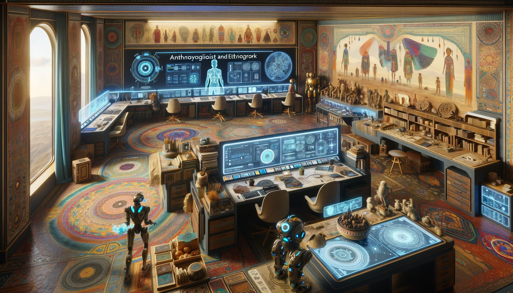

  

    <em><b>Twins and Agents</b> for <b>Product Managers</b></em>

## Twins

Digital twins are software representations of objects, people, processes or systems. For example, cars, influencers, workflows, and cities can all have digital twins.

Like lego, digital twins can be connected to one another. Fleet twins are composed of car twins which are composed of parts twins, which are all interconnected in a complex automotive ecosystem of users, vendors and transactions.

At its core a digital twin is both a record of a thing's past and a guide to its future. More than a static ledger, the promise of a twin that makes it different from a copy or clone is that it has intent and evolves.

!!! tip

    At its core a **digital twin** is both a **record of a thing's past** and a **guide to its future**

## Agents

Agents use tools to execute tasks. They have autonomy to select tools and make decisions in pursuit of an objective. Agents have lifespans limited by the time it takes to complete a task.

If a twin is a startup, an agent is a skilled contractor employed to get stuff done. Generative agents have far more freedom to choose what to work on and how to execute than traditional rules based bots.

!!! tip

    **Digital twins** are **startups** that employ **generative agents** as **contractors**

## Ways of working

Gartner predicts that by 2030 every dollar of IT spend will include an AI component^[1](https://www.gartner.com/en/podcasts/thinkcast/inside-the-gartner-top-strategic-technology-trends-for-2024)^. Bloomberg goes further, predicting that by 2032 10% of IT spend will be allocated to generative AI, and the total market size will exceed 1.3 trillion dollars^[2](https://www.bloomberg.com/company/press/generative-ai-to-become-a-1-3-trillion-market-by-2032-research-finds/)^.

Many AI apps today are merely theatre; a thin skin of marketing and a white-labelled wrapper around a generic LLM designed to ride the hype cycle. The _wasteland of dead and discontinued AI projects_^[3](https://dang.ai/ai-graveyard)^ is a warning that enduring value is more easily found by starting with domain specific user pain points than generic solutions.

A recent study of 758 BCG consultants applies a more rigorous lens and finds that consultants using AI finished 12.2% more tasks on average, completed tasks 25.1% more quickly, and produced 40% higher quality results than those without^[4](https://papers.ssrn.com/sol3/papers.cfm?abstract_id=4573321)^. As knowledge workers, the 18 tasks they tackled are very similar to the types of tasks product managers do.

A key conclusion of the study is that AI infused work can be framed as Centaurs (sequential task handover) or Cyborgs (merged task execution). Both postures allow humans to work with AI to produce more varied, more correct, and better results than either humans or AI can do alone^[5](https://www.oneusefulthing.org/p/centaurs-and-cyborgs-on-the-jagged)^.

!!! tip

    **Human** + **AI** ways of working include **Centaur** and **Cyborg** postures

## :material-key-alert-outline: Key features

Kiln is an app that uses generative AI to help product managers accelerate value creation and capture. It does this by exploring how twins and agents can improve ways of working with product ideas and tasks.

Kiln's key features are:

- **Simple**: One input interface across all tasks
- **Multimodal**: Inputs and outputs work with many data types
- **Curated**: Modern product tools and templates selected with a bias for lean workflows
- **Contextual**: Add custom data sources for more specific and specialised outcomes
- **Automatic**: Agents and twins execute creative and directed tasks autonomously
- **Fast**: Measurably faster cycle and task times, speeding up product development

[Try the App](https://gridpm.streamlit.app){ .md-button .md-button--primary .md-button--stretch}
