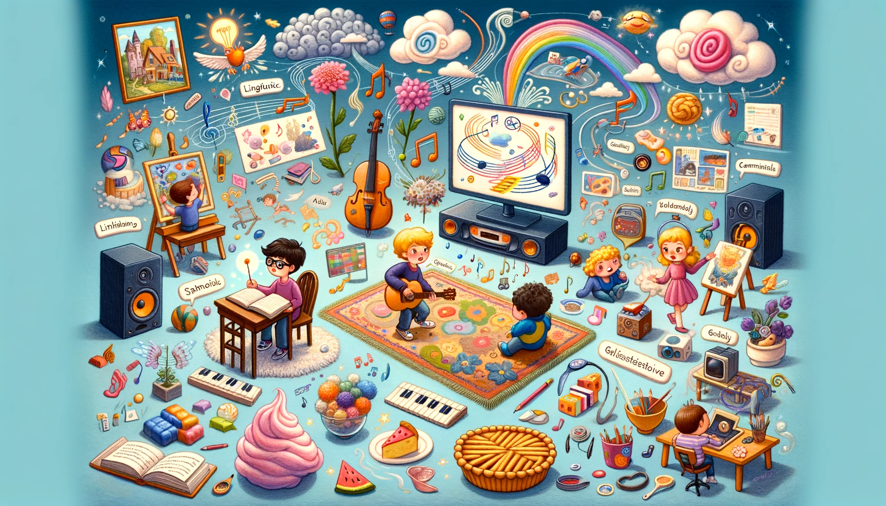
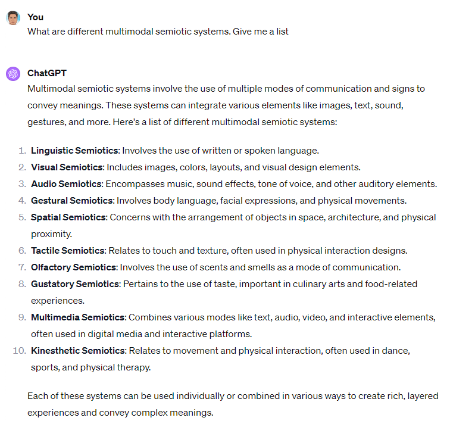
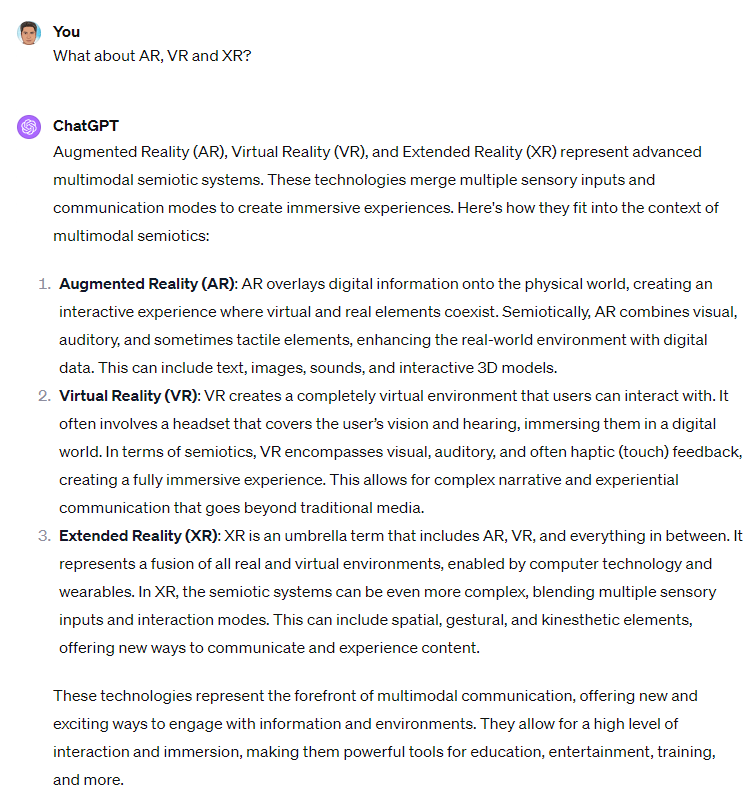
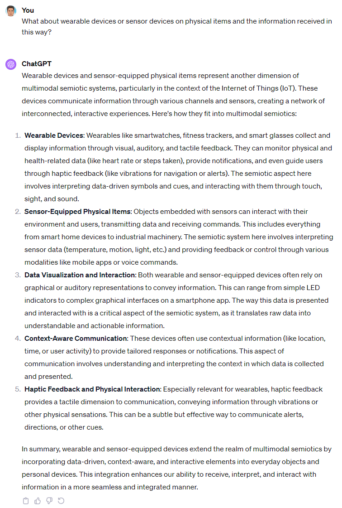

Multimodal literacy - taking in different types of inputs and producing different types of outputs - is an increasingly important feature of LLMs. A few obvious modes are text, speech, audio, image, and video. But I thought I'd just ask ChatGPT to help me learn more. And here's what I got back.

For far more interesting and technical posts on multimodality, see [Multimodality and Large Multimodal Models](https://huyenchip.com/2023/10/10/multimodal.html) or [Multimodal Large Language Models: A Survey](https://doi.org/10.48550/arXiv.2311.13165).
