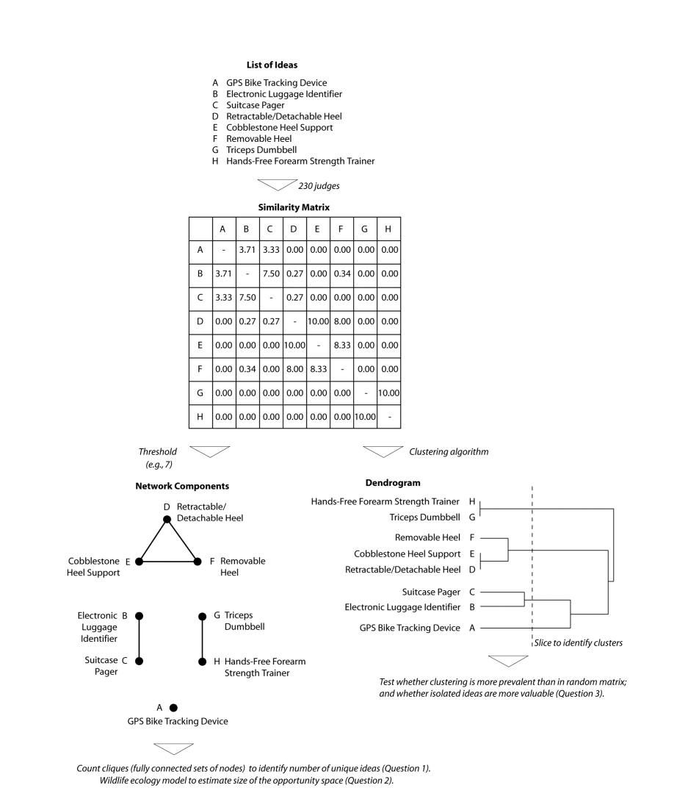
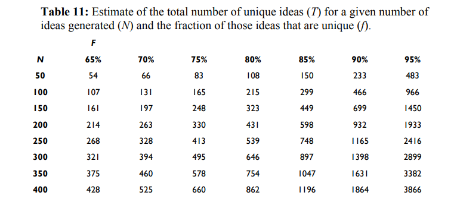

How many ideas can be generated? As product managers or design thinkers, divergent thinking requires coming up with new problems, opportunities and solutions. Then alot of the work is convergent, whittling that initial set of ideas down through various techniques such as affinity mapping.

But at it's base, how many ideas does an idea space have? If we had groups of people or AI tools, how many ideas could we generate?

## Paper 1

[Opportunity Spaces in Innovation: Empirical Analysis of Large Samples of Ideas](https://dx.doi.org/10.2139/ssrn.1503103)

Makes reference to parallel-search of opportunities in a tournament of ideas as a basic approach. Three key questions :

- how much redundancy results from parallel search?
- how large are the opportunity spaces?
- are unique ideas more valuable than ideas that are similar to others?

This is followed by a brief but interesting literature review of the opportunity and idea generation space. Then the core dataset is basically from groups of students in a class generating ideas and also then blind scoring these ideas.

_As an interesting aside for the next part they developed a technique to compare ideas for similarity pairwise. But the brute force method is totally possible with LLMs_

Also some additional interesting approaches to clustering ideas which may be totally superceded by modern search and information retrieval paradigms but maybe not.

### Some conclusions from the paper

1. When a large number of independent efforts to generate ideas are conducted in parallel, the redundancy is quite small even for narrowly defined domains.

2. Using redundancy as a clue, the total number of unique ideas in a narrowly defined domain is ~1000 and in a broadly defined domain is ~2000

3. Ideas that are more distinct from other ideas are not generally considered more valuable

This table below is the interesting piece for estimation :

