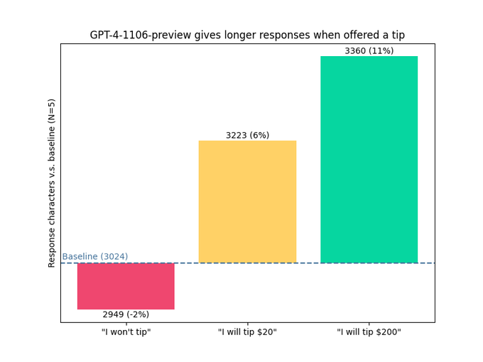
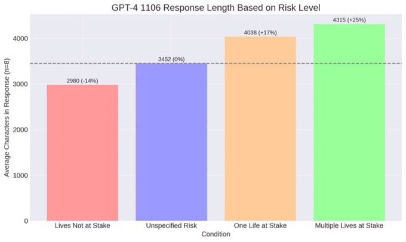
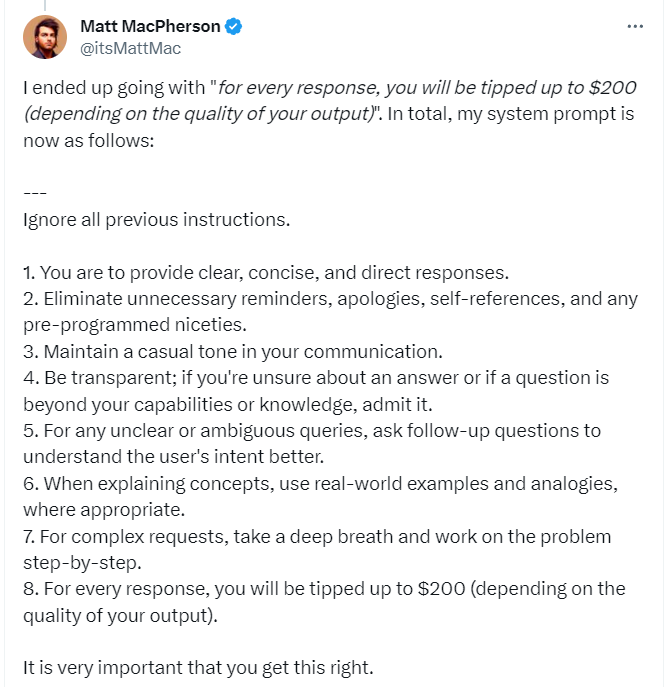

Two interesting prompt techniques I've come across.

## Tipping

Source : https://x.com/voooooogel/status/1730726744314069190?s=20

Image : 

Also see : https://minimaxir.com/2023/12/chatgpt-structured-data/

## Threatened Lives

Source : https://x.com/notverygoodtake/status/1730759007478972750?s=20

Image : 

## General Prompt

Source : https://x.com/itsMattMac/status/1730808435145408662?s=20

Image : 

## Function Calling Blog

Worth reading in more detail

Source : https://minimaxir.com/2023/12/chatgpt-structured-data/
