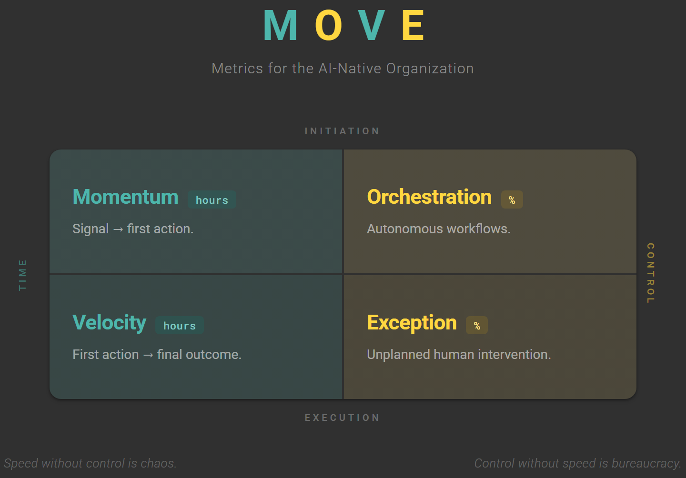

We spent a decade measuring how fast teams ship code. Now the question is how fast the whole organization senses, decides, and acts.

MOVE measures what DORA cannot — how effectively an organization operates when intelligent systems participate in execution. Any organization can buy AI. MOVE asks whether AI changed how the organization operates.

<!-- more -->

## Two Axes

Speed without control is chaos. Control without speed is bureaucracy.

Four metrics — **M**omentum, **O**rchestration, **V**elocity, **E**xception.

---

## Momentum

**The time from a triggering signal to the first action.**

In most organizations, work sits in queues — waiting for triage, routing, assignment, approval. Momentum captures that dead time; not how long work takes, but how long work *waits*.

Intelligent routing and auto-triage collapse the gap between detection and action. If an organization deploys AI and Momentum doesn't budge, it automated execution when the bottleneck was initiation.

---

## Orchestration

**The percentage of workflows designed to run autonomously through AI.**

Orchestration tells an organization whether the operating model changed or it just bought tools. It measures structural coverage — which workflows have been redesigned for machine execution. It won't reach 100% — judgment-intensive work stays human by design.

---

## Velocity

**The time from first action to final outcome.**

Where Momentum tracks how quickly work begins, Velocity tracks how efficiently it finishes. Organizations that start fast often finish slowly; rework, handoffs, and dependencies stretch cycle times long after the first action.

Together, Momentum and Velocity describe the full timeline of work. Fast to react but slow to finish is a different failure mode than slow to react but fast to finish. Neither alone is enough.

---

## Exception

**The percentage of orchestrated workflows requiring unplanned human intervention.**

Orchestration measures coverage by design; Exception measures dependability at runtime. When workflows run autonomously, exceptions are the unplanned moments humans must step in — ambiguity, edge cases, policy boundaries, system failures.

An organization with 1,000 workflows, 600 orchestrated, 30 requiring unplanned intervention: Orchestration is 60%; Exception is 5%. The remaining 400 aren't failures. They're work that belongs with humans.

Orchestration asks: *where should machines run?*
Exception asks: *where machines run, can we depend on them?*

Exception rate is the trust metric. Low rates build the confidence organizations need to expand Orchestration; high rates cause retreat, regardless of what the technology can do.

---

## Performance Profiles

The metrics reinforce each other. Better Orchestration drives down Exception rates; lower Exception rates build confidence to expand Orchestration. Four tiers describe how those patterns cluster in practice.

| Tier | Momentum | Orchestration | Velocity | Exception |
|------|----------|---------------|----------|-----------|
| Elite | < 1 hour | > 60% | < 4 hours | < 5% |
| High | < 4 hours | 40–60% | < 1 day | 5–10% |
| Medium | < 24 hours | 15–40% | < 1 week | 10–25% |
| Low | > 24 hours | < 15% | > 1 week | > 25% |

**Elite.** Machines run workflows end to end. Humans govern policy and handle novel exceptions.

**High.** Machines handle most execution. Humans design workflows and manage escalations.

**Medium.** Humans run most workflows. Machines assist with discrete tasks.

**Low.** Humans run everything. Machines play no structural role.

*These thresholds are illustrative. Actual targets depend on workflow type, industry, and complexity. A < 4 hour Velocity is elite for incident response; it's meaningless for employee onboarding. The table describes the pattern — fast initiation, fast execution, broad coverage, low failure — not the prescription. Set baselines per workflow class.*

---

## The Factory Model

Ask one question of every step in every workflow: *why is a human doing this?*

Applied once, it improves a process. Applied relentlessly, it changes the production model. Small teams can now run software factories — specifications in, validated outcomes out, no humans on the production line. The industrial model changed, and the headcount followed.

Training 300 engineers to use AI tools does not produce this. That is the same factory with a faster conveyor belt. The scaling question is not how to train 300 people — it is how to replicate factories. Thirty operators who replicate software factories across domains will outproduce 300 engineers with copilots.

Training improves how people work within the existing system — Momentum lifts, Orchestration plateaus around 25%. The system hasn't changed. Only the tools have. Factories replace the system itself — Orchestration passes 60%, Exception rates drop below 5%. Not because people got better, but because the structure around them did.

---

## Getting Started

Start with one workflow. High-volume, well-understood: customer requests, incident response, new hire onboarding.

**Measure Momentum and Velocity.** These require only timestamps. When did the signal arrive? When did action begin? When was the outcome complete? Most organizations can extract this from existing systems.

**Assess Orchestration.** Map the workflow steps. Which are executed or coordinated by an intelligent system?

**Track Exceptions.** Count unplanned interventions. Divide by total orchestrated executions.

**Expand.** Apply the pattern to additional workflows. Aggregate to organization-level scores.

---

The constraint has moved beyond code deployment. What matters now is how the whole organization operates.

Every operational era develops its own measurement language. Manufacturing brought throughput and defect rates; cloud computing, uptime and latency; DevOps, DORA. The AI-native organization needs MOVE.

Workflows must not wait for people. Failures must not wait for people.
