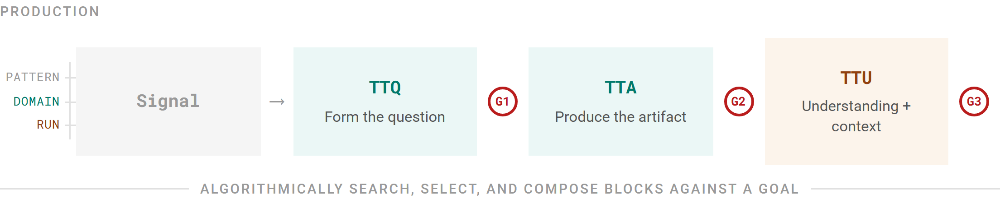
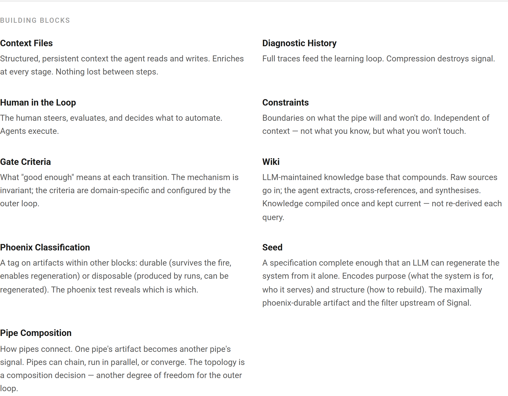

Three engineers at OpenAI produced a million lines of code last year. None of it was written by hand. What made that work was the structure around the model, not the model itself: a pipeline where quality gates check every transition and failures loop back as structural fixes rather than prompt patches.

Tatsunori Hashimoto named the discipline: when an agent makes a mistake, engineer a structural fix so it can never make that mistake again. Birgitta Böckeler, writing on martinfowler.com, distinguished what steers agents before they act from what corrects them after, mapping a taxonomy of guides and sensors. Anthropic's multi-agent research showed the shape at a different scale: separate generation from evaluation, make the evaluator skeptical, loop until everything passes. Four groups, different problems, the same skeleton.

That skeleton is a pipe. A signal enters, gets transformed through stages, and produces an artifact, with quality checked at every seam. The scientific method follows this shape; so does OODA. The structure is older than software, the basic form of structured inquiry.

But if harness engineering names only the pipe, then what has been named is not new. The field needed explicit terminology for the age of agents, and the terminology is valuable. The question is whether an architecture exists underneath: something an engineer can compose and configure, something that explains how the system that produces runs gets better over time. The pipe comes first, because you need the skeleton before you can see what has grown around it.

<!-- more -->

## The production pipe

Three measures mark the pipe's stages, and each one times comprehension rather than throughput. Tudor Girba and Simon Wardley named the first two in *Rewilding Software Engineering*, identifying something the field had overlooked: we have sophisticated measures for how fast we act — deployments, recovery time, change lead time — but almost nothing for how fast we understand.

**TTQ — Time to Question.** A signal arrives: a market shift, a failing test, a customer saying something unexpected. TTQ measures the time from that signal to a question specific enough that evidence could distinguish it from the null.

**TTA — Time to Answer.** From the question to a verified artifact that passes review.

**TTU — Time to Understand.** From the finished artifact to the point where you could explain it on stage without notes. Girba and Wardley did not name this measure, but they pointed at the gap it fills. As humans retreat from the decision loop, they warned, comprehension of the system decays, and with it the ability to steer. TTU makes that decay visible.

Between each stage sits a quality gate: G1 checks whether the question is testable and relevant, G2 whether the artifact is grounded and sound, G3 whether understanding actually occurred.

*The pipe: signal enters, measures time each transformation, quality gates enforce standards at every transition. The outer loop bar beneath is where the pattern diverges from the scientific method.*

This entire structure maps to frameworks that predate software: observation, hypothesis, experiment, conclusion; observe, orient, decide, act. The pipe is shared heritage.

What the harness engineering conversation has described so far is how to build a reliable pipe. Context engineering, architectural constraints, entropy management are different angles on the same question; the multi-agent pattern separates generation from evaluation within the pipe. The field frames this as an evolutionary ladder, from prompt engineering (what to ask) through context engineering (what to send) to harness engineering (how the whole thing operates). Each rung widens the unit of design, but all three describe the pipe at different magnifications. The pattern underneath is what happens around the pipe.

## The building blocks

A pipe with no building blocks is a clean process that forgets everything between runs. It produces artifacts but learns nothing from them, compounds no knowledge across iterations. What gives a harness its character is the set of building blocks composed around and within the pipe.

A building block is present or absent without breaking the pipe, configurable on its own, and domain-agnostic at the pattern level. Nine have emerged so far, in three roles.

**Blocks that persist knowledge across runs.** Context Files carry structured context the agent reads and writes, enriched at every stage, nothing lost between steps. The design principle is a map, not an encyclopedia. In a clinical trial harness, context files carry the protocol, prior results, and regulatory requirements forward through every stage; no investigator re-reads from scratch. What makes them powerful is compounding: each run starts where the last one left off.

Diagnostic History stores full traces of every run. Entropy in an agent-generated codebase compounds like a high-interest loan (inconsistent naming, dead code, duplicated logic), and the traces are how the debt gets tracked. Wiki compounds in the opposite direction: an LLM-maintained knowledge base where, after the fifth executive brief on a topic, the sixth begins at a higher baseline.

**Blocks that govern behavior.** Constraints define what the pipe will not do: enforced dependency directions, rigid layering, a novelist's rule that certain themes stay out. Gate Criteria define what "good enough" means at each transition. The gate mechanism is invariant; the criteria are domain-specific. The separation is load-bearing: agents cannot reliably evaluate their own work. Left to self-evaluate, they rewrite test suites to match their code or satisfy assertions with `return true`. Gates must be architecturally external, enforced by the system rather than trusted to the agent. Practitioners building evaluation infrastructure at scale have found that error analysis (the careful work of studying where and why gates fail) ends up consuming the majority of real development effort, often dwarfing the time spent on the pipe itself. Building the thing that tells you whether the pipe is working turns out to be harder than building the pipe.

Human in the Loop is fully optional. An algorithmic trading harness runs autonomously: the system detects an anomaly, formulates a hypothesis, executes a trade, evaluates the outcome. The result is still a harness, provided the outer loop exists. What defines the pattern is the mechanism that evolves the pipe, whether or not a human is present.

**Blocks that define what endures and how pipes relate.** Phoenix Classification tags every artifact as durable or disposable. You discover which by running the phoenix test.

Seed is where purpose lives: a specification complete enough that an LLM can regenerate the system from it alone, encoding both purpose and structure. In a clinical trial, the Seed is the trial protocol; burn everything else, and a competent team reconstructs the study from the protocol alone. In creative work, the Seed governs what enters the pipe. A novelist's Seed says: don't fire the pipe until this image has haunted you for weeks. The Seed filters upstream of Signal, deciding what is worth processing at all.

Pipe Composition defines how pipes connect: chaining, running in parallel, converging. The topology itself becomes a degree of freedom the system can search.

*The building blocks: nine composable elements in three roles. Present or absent without breaking the pipe.*

These nine are not a closed inventory. They are a search space, open by design, with an admission criterion (composable, configurable, applicable across domains) that tests new candidates. Different compositions produce different harnesses. An algorithmic trading harness composes Context Files, Constraints, Gate Criteria, Diagnostic History, and Pipe Composition, with no Human in the Loop and no Wiki. A research harness composes all nine. Nine blocks with binary presence-or-absence yield 512 possible compositions, each carrying its own configuration space. Fixed blocks with no composition produce a single harness design; the outer loop would have nothing to search. Composability gives the pattern a space to explore.

## The outer loop

The building blocks explain what a harness is made of, but they do not explain how it changes.

Every team runs retrospectives. Every quarter, someone reviews the process and suggests improvements. A retrospective, though, is a meeting: it runs on opinions, happens on a calendar, and rarely consults the execution data from actual runs. The outer loop is a mechanism that reads diagnostic history and recomposes blocks based on what the fitness function reveals. The difference between a retrospective and an outer loop is the difference between someone remembering what went wrong and a system that recorded it.

The outer loop algorithmically searches and recomposes building blocks against a goal, operating in two modes.

**Cold start.** Given a domain description and no history, the outer loop examines the domain's characteristics (what signals exist, what artifacts it produces, where quality fails) and selects an initial composition.

**Warm loop.** As history accumulates, the same mechanism recomposes blocks based on what the data shows is working.

The mechanism is identical in both modes; only the input differs. Cold start works from a domain description, warm loop from run history.

A concrete instance: a taxonomy pipeline with three run types. Generate produces taxonomy updates from conversation data; Assess evaluates quality; Update examines prior history and restructures the taxonomy on a seven-day cadence. The Update run is the outer loop, automated: it reads accumulated evidence from Generate and Assess runs, then recomposes the taxonomy structure by adding, merging, splitting, or removing nodes. The pipe that produces taxonomies is itself reconfigured by a mechanism that reads the pipe's output.

The outer loop need not run one experiment at a time. Multiple block variants can run simultaneously, measured against the same fitness function, converging on compositions that work through parallel experimentation across the search space.

The outer loop turns harness engineering from a workflow into an architecture. The blocks form the search space; the outer loop performs the search. Without it, configurable blocks are flexible but frozen.

## The fitness function

A search needs an objective, and the outer loop has one. TTQ and TTA are production measures that time how fast you reach the quality bar. Gate quality is embedded in the measurement: the gates enforce quality, the measures optimize speed. Speed here means time to reach the quality threshold, not time to produce output.

The outer loop uses TTQ and TTA as its fitness function. A composition that yields lower times (faster quality questions, faster verified artifacts) is fitter, and the loop selects accordingly. But the fitness function has a third term.

TTU times something the field does not measure: whether the humans and systems producing work are actually improving, or merely accelerating. It operates through two channels.

The first is human. Working intimately with AI agents transforms the engineer's thinking and judgment. What atrophies without TTU is the capacity to steer a system you no longer fully understand: to ask the right question, and to distinguish good work from adequate work when everything the system produces looks plausible. TTU measures whether that capacity is growing.

The second channel is environmental. The act of genuinely understanding what was produced changes the system itself. When someone works through an artifact until they can explain it without notes, they do not merely grow smarter. They update context files with what actually matters. They refine the seed based on what was missing. They sharpen gate criteria based on what "good" actually looks like. They annotate diagnostic history with insights the raw trace does not contain. Comprehension materializes into the building blocks.

The flywheel turns through both paths. Deep understanding produces sharper questions (the human path) and enriches the building blocks directly (the environmental path); context files grow more precise, and gates learn what "good" looks like. Each run's artifacts are easier to understand because the previous cycle's understanding improved the system that produced them.

When the builder and the inspector share the same blind spots (when an agent generates code and an agent evaluates it, both drawing on the same training data) testing becomes circular. The system cannot catch what neither side can see. Only the human's understanding can break that circle, and the understanding then encodes into gate criteria the system previously lacked. The environmental channel is how human insight enters the machine.

Remove TTU from the fitness function and both channels starve at once. The human stops absorbing what was produced, so questions get shallower; the building blocks stop being enriched, so the system's context stagnates; gates soften because neither side is sharpening them. The system becomes a conveyor belt: high volume, declining quality, a human increasingly unable to steer and an environment increasingly unable to support good work.

If TTU cannot be automated, how does an algorithmic loop optimize against it? By detecting its absence. TTU failure shows up downstream: question quality degrades, G3 rejection rates climb, the human's own assessments flag gaps. A composition that produces fast artifacts but leaves the human unable to explain them (and the building blocks unchanged) generates a characteristic signature, and the outer loop selects against it.

TTU is irreducibly human in process. You cannot automate genuine understanding. But it is system-wide in effect — the only term in the fitness function that improves both the human and the environment the human works within. Break the return path and production continues, but neither side of the partnership improves, and the system stops getting better at getting better.

## One level deeper

The architecture applies to itself.

The outer loop is itself a harness instance. Run history and gate failure rates serve as its signals; its TTQ asks whether the current block composition is optimal; TTA produces recomposed configurations; TTU (through both channels) is the system's understanding of what works and why, encoded into its own building blocks. The result is a harness within a harness, each level examining the one below it, recursing until a human or an external constraint says to stop.

Concrete case: a taxonomy pipeline initially restructures on a fourteen-day cadence. After several cycles, accumulated evidence shows that weekly restructuring produces higher coherence scores; fourteen days is too long, and the taxonomy drifts. The mechanism that restructured taxonomies was itself restructured, based on its own performance data.

A non-recursive pattern cannot do this. It can optimize the pipe and recompose blocks, but when a regulatory change makes the gate criteria themselves obsolete, or a new signal type arrives that the current composition cannot process, it keeps optimizing against criteria that no longer apply. Think of a thermostat maintaining 72°F in a building repurposed from office to server room: it cannot detect that its own evaluation has drifted. Self-referentiality catches this. The system can examine whether its improvement process is still valid, a question the non-recursive version cannot even ask.

## The counter-position

There is a direct challenge to this architecture, and it comes from practitioners building the most capable AI systems available today. Anthropic's Claude Code team builds what they call a thin harness: the thinnest possible wrapper around the model, rewritten from scratch every few weeks as the model improves. Competitive advantage, in their view, lives in the model. Noam Brown argues the stronger version: as reasoning capabilities improve, scaffolding gets absorbed by the model itself. Harness engineering becomes transitional.

Both positions deserve to be taken seriously, and there is a resolution that respects both. What Anthropic rewrites every few weeks is the pipe: tool orchestration, prompt structure, workflow sequencing. The pipe should be thin and disposable; it tracks model capability and changes as the model changes. The meta-layer — composable blocks, the outer loop, the fitness function with TTU — is a different kind of thing. It is the mechanism that exploits model improvement. A better model makes the pipe simpler and the outer loop more powerful.

Teams operating fully autonomous development pipelines have arrived at the same conclusion from the opposite direction: validation infrastructure turns out to be the binding constraint on autonomous production. The engineering discipline lives in the harness.

Evidence supports the distinction independently of which side you start from. Changing only the harness moved LangChain's coding agent from outside the Top 30 to Top 5 on Terminal Bench 2.0, accuracy jumping from 52.8% to 66.5%. The architecture matters regardless of what the model can do.

The thin harness position and the deep architecture position operate at different levels of the pattern.

## Maturity

If the architecture holds (self-improving, compatible with model improvement) the question becomes where the human sits. A harness matures by moving the human to higher-leverage work, progressing outward: from doing the work, to steering it, to evolving how it gets done, to defining why it exists.

**Early.** The human is in the pipe, doing TTQ, TTA, and TTU manually. Blocks are rudimentary or absent. Most people using AI assistants today are here; the pipe exists, but the human does most of the work inside it.

**Middle.** The human is at the gates. Blocks handle the stages; the human evaluates and steers at transitions. Research and executive briefing harnesses typically operate here: templates and skills handle production, the human applies judgment at quality gates.

**Late.** The human is in the outer loop. The pipe runs autonomously; the human evolves it by adjusting gate criteria and recomposing blocks. A knowledge graph pipeline that auto-generates updates, evaluates them with an LLM-as-judge, and auto-merges on pass operates here.

**Mature.** The human is at the Seed, defining purpose and constraints while the system handles everything else, including its own evolution. A taxonomy pipeline that generates and assesses its own output, restructuring itself on a seven-day cadence, approaches this level. The human defined the taxonomy's purpose and restructuring criteria; everything else runs autonomously. The human intervenes when purpose changes. A three-person engineering team operates here: their charter forbids writing or reviewing code; their role is designing specifications and validation infrastructure.

The model has boundaries. A factory routine (fixed inputs, fixed procedure, fixed outputs) is the simplest case, and the one where the pattern adds nothing because the outer loop has nothing to search. In fully automated domains, TTU may operate at supervisory cadence rather than per-run; the pattern still applies, but understanding shifts from per-artifact comprehension to system-level insight.

This is not a prescription for full automation, and not every domain should reach Mature. Some are correctly served by Middle indefinitely. A novelist's harness at Mature does not mean the novelist is absent; it means the novelist operates at the Seed, defining what the work is about and what constraints govern output. The pipe handles drafting, revision, structural evaluation. The human is still there, at the level where purpose lives.

The maturity model is a lens: where is the human now, and is that where they should be? If the human is doing gate evaluation on a pipe with a 98% pass rate, the answer is no. If the human is at the Seed but cannot explain what the pipe produces, TTU has failed through both channels, and the human needs to move back in. But how do you know what the system has actually captured versus what still lives only in someone's head?

## The phoenix test

Burn everything and rebuild from what the harness knows.

Wipe the artifacts, the intermediate state, the accumulated output. What the harness regenerates reveals what it has actually captured; what it cannot regenerate is what was lost — knowledge that lived in someone's head, in an undocumented process, in a configuration never committed.

Phoenix classification gets populated through testing. Run the test and see what survives. What comes back is durable; what does not is disposable.

The Seed is the maximally durable artifact: a specification complete enough that an LLM can regenerate the system from it alone. If the Seed survives the fire, the system can be rebuilt. If it does not, the system was never fully specified; it depended on knowledge that existed outside the harness. When code is opaque, its correctness inferred from behavior rather than inspection, the specification is the system and the code is its current rendering.

Run the test against a knowledge graph pipeline. The Seed is the schema definition and extraction rules. Burn it all. The schema and extraction rules come back (they were in the Seed), and so does the pipeline structure. The knowledge graph itself, though, thousands of entities and relationships accumulated over months, does not come back. It is disposable, regenerable by re-running the pipe against source material. The test reveals that the graph's value lives in the pipe and the Seed. Knowing this changes where you put your effort.

The phoenix test is uncomfortable because it exposes the gap between what you think the harness knows and what it actually knows. Most systems would lose more than their operators expect.

## What the pattern is

The pipe is shared heritage, a skeleton of inquiry centuries old. Girba and Wardley gave us the language for what the pipe measures and the warning about what happens when we stop understanding. The contribution here is the meta-layer built on that foundation: composable building blocks that form a search space, an outer loop that searches and composes those blocks against a goal, TTU as the fitness term that operationalizes their concern through both the human and the environment, and self-referentiality that makes the pattern fractal.

The pattern operates at three levels: the diagram itself (domain-agnostic), its instantiation for a specific field, and a single run of the pipe. This post describes the first. Domain instantiation and run-level engineering are where most of the building happens.

Nine building blocks have been discovered so far; more exist. The outer loop explores the space. What the pattern provides is the architecture for that exploration, and the test of whether your system actually knows what you think it knows.
