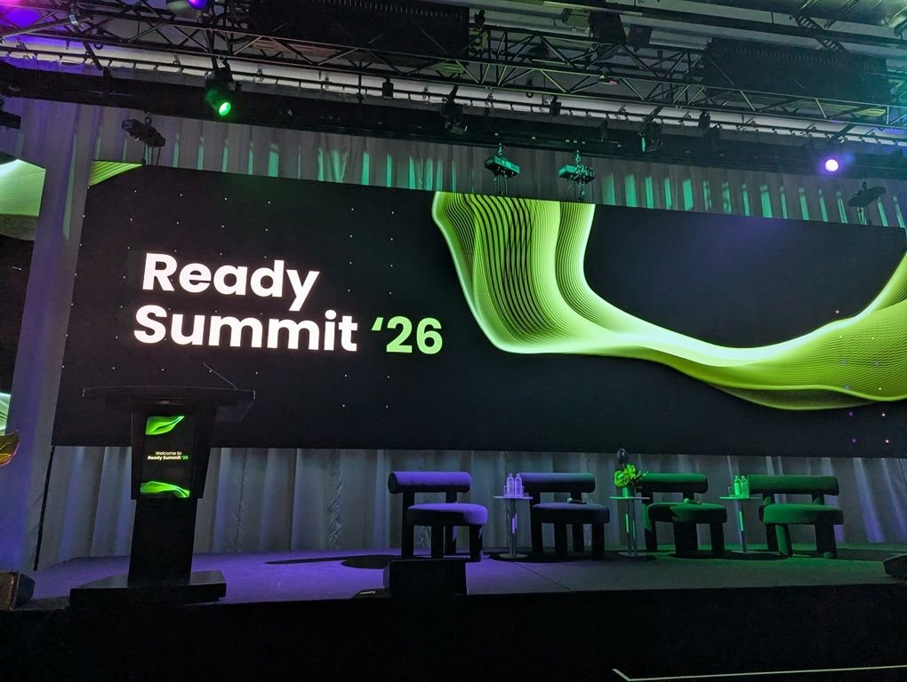
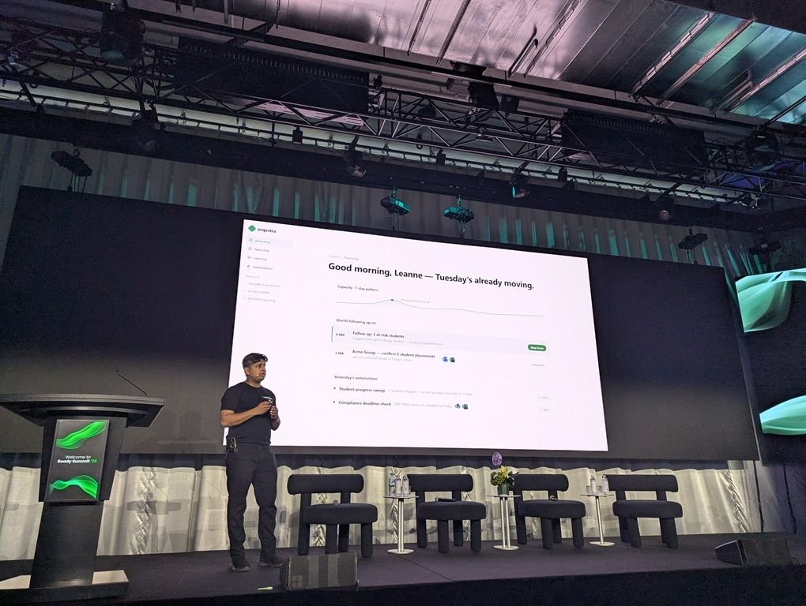
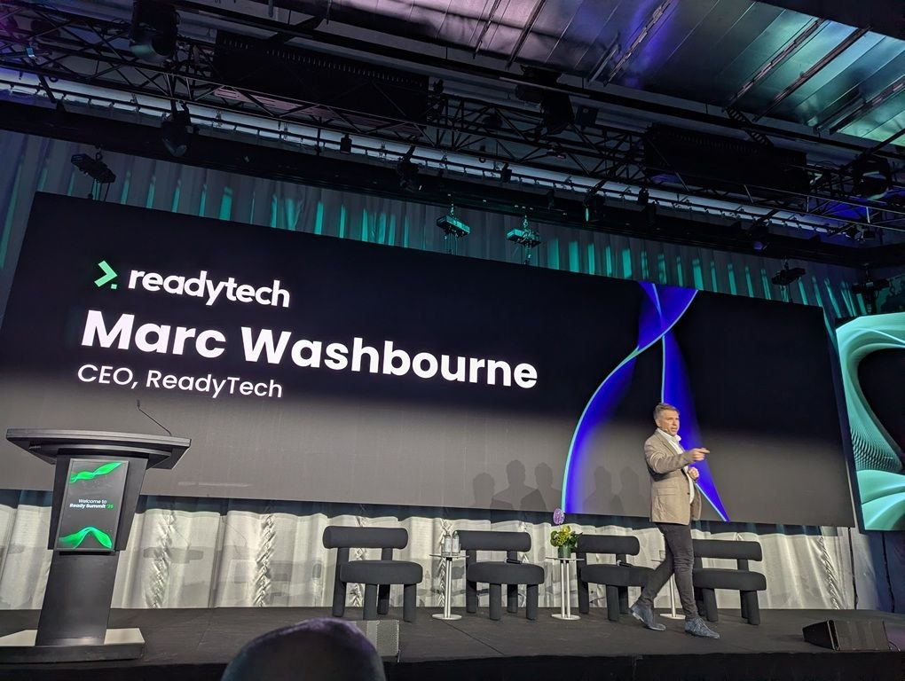
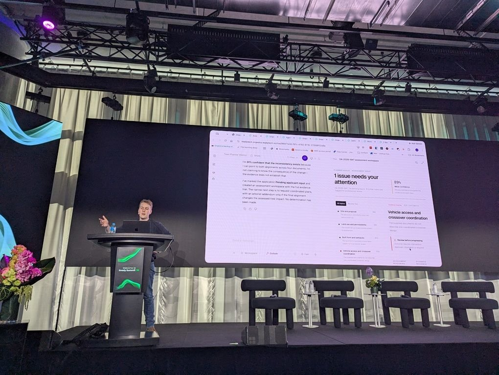
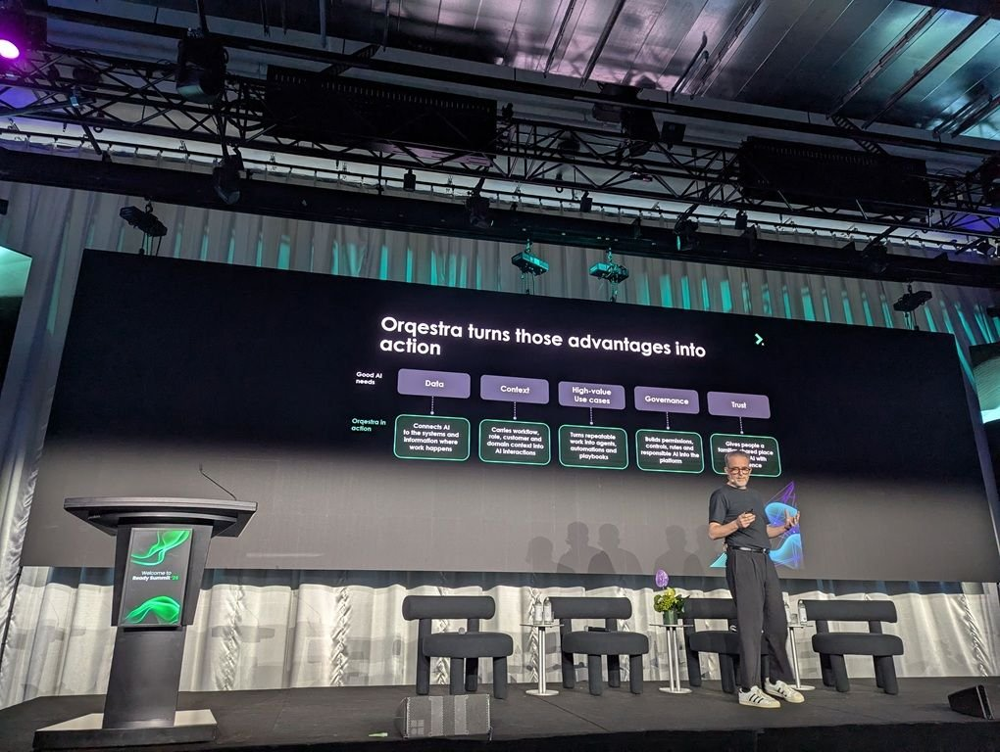

I launched Orqestra earlier this week at Ready Summit '26, in front of several hundred people in Melbourne and again in Sydney. We built it to speed up the compliance-heavy, domain-specific work our clients do in Education, Workforce, Work Pathways, Local Government and Justice. But it's more than accelerating the work. We also built it to help the people behind that work understand and steer AI better, manage their careers and develop their workforces.

<!-- more -->

When software fails in these places, somebody doesn't get paid, or doesn't get a place, or stays in a system longer than they should have. Getting to work on that is a privilege, and it comes with an obligation. We owe these communities innovation that's worth having, delivered at a pace people can absorb, because change costs something to everyone living through it and it has to be worth what it costs. Better, faster and safer, and not only this year but for as long as they have to live with what we've built.

Curiosity is a big part of why I do this. David Brin's *Kiln People* has been in my head for years: a world where you make a cheap clay copy of yourself in the morning, send it out to do a day's work, and download what it learned before it expires at night. Something close to that is real now. I'm trying to figure out where this technology takes us.

Susanna Clarke's Piranesi lives in a House with no outside. Endless halls, thousands of statues, tides that rise through the lower rooms and drown them. He spends his life learning it: counting the halls, cataloguing the statues, writing down the tides, feeding the birds. Twice a week another man comes, and that man is looking for something, a Great and Secret Knowledge he believes is hidden in the building. He never learns the House. He searches it. He walks past ten thousand statues and doesn't see one of them, because a statue is worth nothing to him. Everyone building with AI right now is one of those two men. The work our clients do is a house like that: enormous, particular, most of it never written down, held in the heads of people who have spent twenty years in the halls. You can strip-mine it, or you can learn it. We built Orqestra to learn it.

*Photos: [Ready Summit '26](https://lnkd.in/p/gEUCSRVX)*
