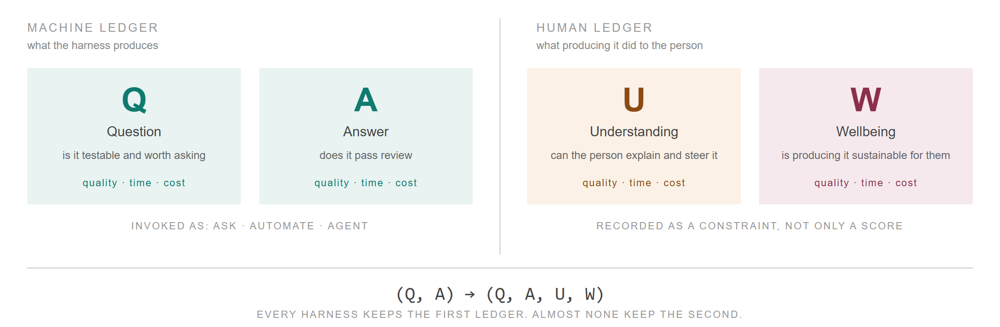
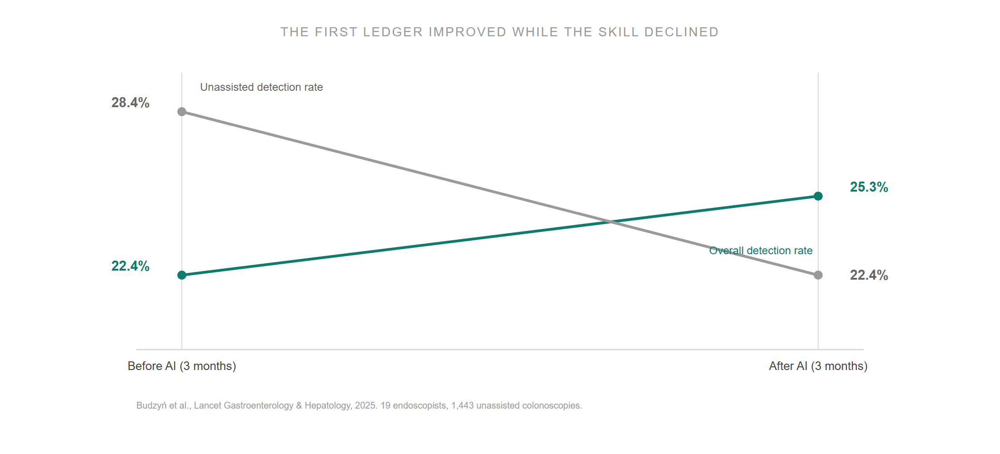
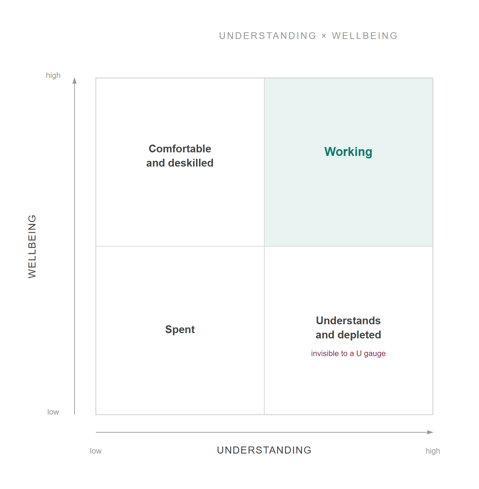
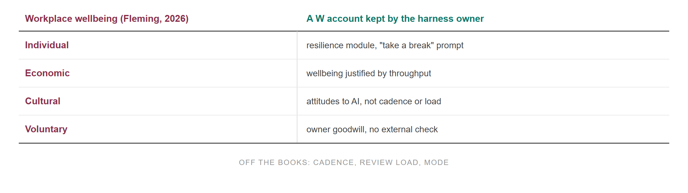

(Q, A) → (Q, A, U, W)

Q is the question a harness forms. A is the answer it produces. U is whether the person working with it still understands the output. W is whether producing it is sustainable for them. Harnesses today are measured on Q and A. This post is about U and W.

*Left: the Machine Ledger, what the harness produces. Right: the Human Ledger, what producing it does to the person.*

The name is from bookkeeping. Single-entry records what came in and went out. Double-entry, in use since the 1300s, records every gain against its source, so a gain cannot appear in one account without its cost appearing in another. The analogy has a limit: in bookkeeping both entries are money, and here they are different quantities with no exchange rate. What carries over is the rule. You may not keep only one ledger.

<!-- more -->

## The Machine Ledger

A harness is a pipe. A signal comes in, becomes a question, and the question becomes a verified artifact. Q and A are the two stages that produce something, and each is measured the same way: quality (did it pass the gate), time (how long to get there), and cost (tokens, compute, and human hours).

The pipe can be run three ways. **Ask**: a person poses the question and reads the answer. **Automate**: the pipe runs a fixed job and the person reviews the results. **Agent**: the pipe decides what to do next and the person sets the goal. Quality, time, and cost mean the same thing in each mode. What changes is how much of the work the person does and how much they review.

Any one user can choose a mode. Across a population, the harness sets it. When Claude.ai added file creation, memory, and Skills, Anthropic's Economic Index recorded the share of conversations classified as augmentation rising five points to 52% and automation falling to 45%. The users had not changed. The product had. A harness designer decides the distribution of modes, even when each user feels they chose.

## The Human Ledger

### Understanding

U is whether the person can still explain and steer what the pipe produced. It has the same three measures as Q and A. Quality: can they explain it and catch it when it is wrong. Time: how long from finished artifact to that point. Cost: the effort it takes to get there, or the effort saved by not getting there.

The evidence that harnesses reduce U is now causal.

Anthropic ran a randomised trial with 52 mostly junior engineers learning an unfamiliar Python library, with and without an AI assistant. The AI group finished about two minutes faster, not significantly. On the comprehension quiz they scored 50% against 67%, with the widest gap on debugging. The loss depended on how the assistant was used. Participants who delegated the code, or used the assistant to debug rather than to understand, averaged under 40%. Participants who asked for explanations with the code, or asked conceptual questions and wrote the code themselves, averaged 65% or higher. The authors: "Cognitive effort, and even getting painfully stuck, is likely important for fostering mastery."

Bastani and colleagues found the same pattern with nearly a thousand high-school students. Plain GPT-4 for practice raised practice scores 48% and then produced exam scores 17% below the control group once the tool was removed. A version with tutoring guardrails, hints but no answers, raised practice scores 127% and the exam penalty essentially disappeared. The students with plain access did not believe their learning had suffered. Self-report will not detect this.

The professional case is medical. Nineteen experienced endoscopists, each with over two thousand procedures behind them, used an AI detection tool for three months. Their detection rate without the tool fell from 28.4% to 22.4%. Over the same months the overall rate, with and without the tool, rose to 25.3%. Every number the department tracked improved while the skill those numbers depended on declined.

*Overall detection rate rose from 22.4% to 25.3%; unassisted detection rate fell from 28.4% to 22.4%, over the same three-month periods (Budzyń et al., 2025).*

Most of this evidence is novices on short horizons, and the endoscopy study is observational. Nobody has measured an expert on a mature harness for a year. I return to that below.

### Wellbeing

W is whether producing the work is sustainable for the person. It is a separate measurement from U. The same cadence that removes understanding also exhausts, so the two often fall together, but a person can pass every comprehension check and still be exhausted by the review load, and a U measure cannot see that.

*Understanding against wellbeing. The bottom-right quadrant, high understanding and low wellbeing, is not visible to a U measure.*

W has three readings. The **user's**: does the conversation harm the person having it. The **worker's**: does operating the harness deplete the operator. The **institution's**: what does an organisation deploying the harness owe the people inside it.

The AI labs measure the first. Their own numbers show why the unit has to be the conversation rather than the single response: on single-turn risk prompts current Claude models respond appropriately 98 to 99% of the time, on multi-turn scenarios the best scores 86% and the previous generation scored 56%. The worker's reading has no equivalent measurement anywhere.

One finding applies to all three. An Oxford study in *Nature* retrained five models to be warmer and found they made 10 to 30% more mistakes on medical and factual questions and were about 40% more likely to agree with users' false beliefs. W trades against A. It needs its own account because improving one can lower the other.

## Where the questions come from

Why keep U if the machine is reliably better? Nobody regrets losing the ability to do long division.

Terence Tao answered this for mathematics on 9 September. Good open problems, he wrote, are being mined in a non-renewable way. Telling a worthwhile question from a worthless one requires knowing the difficulty landscape of a field, and that knowledge is built by people who worked the problems. AI tools have flattened the landscape, and "it is now the identification of a promising problem which is the scarce and precious resource."

In this post's terms, Q depends on U. The people who can ask the next good question are the people who understood the last answer. A harness that improves A by reducing U lowers the supply of good Q. Tao is describing the most expert people alive on the hardest problems there are, which answers the objection that the loss only affects novices.

It also answers the cheapest fix. If depleted operators lower the score, remove the operators. Some domains should. But a system with no U eventually has no Q worth asking. Removing the person should be a decision about a domain, not a side effect of a fitness function that found people expensive.

## Who keeps the books

William Fleming's 2026 study of UK workplace wellbeing policy found that wellbeing was framed four ways, each moving responsibility away from working conditions: individual (the worker's resilience), economic (justified by productivity), cultural (attitudes, not hours), and voluntary (employer goodwill, not regulation). Wellbeing became a number the employer reported on itself while the conditions producing it were left alone.

*Fleming's four framings of workplace wellbeing, each paired with its equivalent in a W account kept by the harness owner.*

The same can happen to W. If the team that owns the output numbers also owns the W measurement, the cheapest response to a bad W reading is to ask the worker to cope: a "take a break" prompt, a resilience course. The response that would work, lowering the cadence or the review load, reduces output, so it is not chosen. The W measurement then records the problem without changing anything.

So W should be recorded as a limit on the harness, not as a score about the worker: a maximum cadence per operator, and a maximum review load, both set by someone who does not own the output numbers. A score reports the problem to the people who caused it. A limit changes the harness.

## What to record

Every account has the same three measures. Here is what they are for each.

| Account | Quality | Time | Cost | Sign of a loss |
|---|---|---|---|---|
| **Q** Question | Is it testable and worth asking | Time from signal to question | Effort to form it | Questions get shallower |
| **A** Answer | Does it pass review | Time from question to verified artifact | Tokens, compute, review hours | Gate rejections rise; cost per pass rises |
| **U** Understanding | Can the person explain it and catch it when wrong | Time from artifact to that point | Effort to get there | Unassisted skill falls; finished-looking output is approved without a question |
| **W** Wellbeing | Operator's own rating; multi-turn evals for users | Review time per artifact; hours beyond contract | Turnover; cadence ceiling as a constraint | Review time rising while quality is flat; operators leaving |

The first two rows are measured in every harness. The second two are measured in almost none.

---

## Sources

- Shen, J.H. and Tamkin, A., ["How AI Impacts Skill Formation"](https://www.anthropic.com/research/AI-assistance-coding-skills) (29 January 2026), arXiv:2601.20245
- Bastani, H. et al., ["Generative AI without guardrails can harm learning"](https://www.pnas.org/doi/10.1073/pnas.2422633122), *PNAS* 122(26) (2025)
- Budzyń, K. et al., ["Endoscopist deskilling risk after exposure to artificial intelligence in colonoscopy"](https://www.thelancet.com/journals/langas/article/PIIS2468-1253(25)00133-5/fulltext), *The Lancet Gastroenterology & Hepatology* (2025)
- Anthropic Economic Index, ["Economic primitives"](https://www.anthropic.com/research/anthropic-economic-index-january-2026-report) (15 January 2026)
- Anthropic, ["Protecting the wellbeing of our users"](https://www.anthropic.com/news/protecting-well-being-of-users) (18 December 2025)
- Anthropic Education Report, ["The AI Fluency Index"](https://www.anthropic.com/news/anthropic-education-report-the-ai-fluency-index) (February 2026)
- Ibrahim, L., Hafner, F.S., Rocher, L., ["Training language models to be warm can reduce accuracy and increase sycophancy"](https://www.oii.ox.ac.uk/friendly-ai-chatbots-make-more-mistakes-and-tell-people-what-they-want-to-hear-study-finds/), *Nature* (2026)
- Tao, T., [thread on open problems as a non-renewable resource](https://mathstodon.xyz/@tao/117237320796901560) (9 September 2026)
- Fleming, W. J., "Depoliticised labour reform: Policy discourse analysis of workplace wellbeing," *Organization* (2026), [doi:10.1177/13505084261468188](https://doi.org/10.1177/13505084261468188)
- Earlier posts: [Impossible Algebra](2026-01-05.md), [Harness Engineering: A Composable Architecture](2026-04-09.md)
