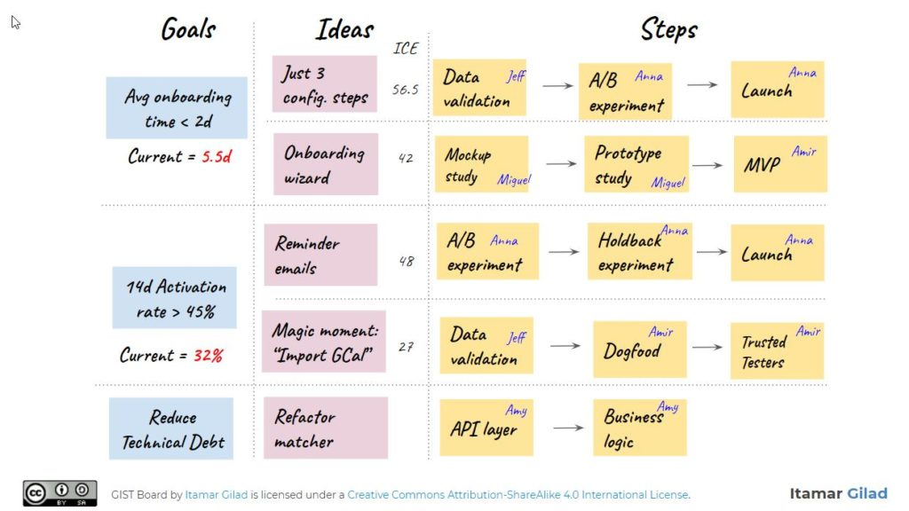
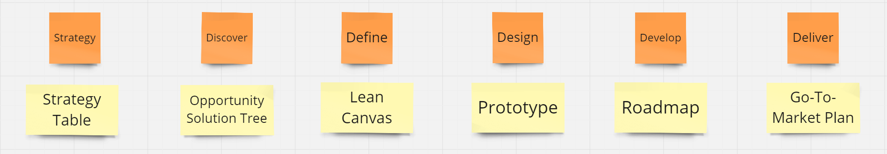

Where product managers end up is not where they start. _Build-measure-learn_ and _design thinking_ are two powerful ways to accelerate value creation and capture. Kiln uses these concepts - framed as loops and documents respectively - as foundational schemas in implementation.

## Loops

GIST is a modern approach to learning loops; it stands for **G**oals, **I**deas, **S**teps and **T**asks. The underlying theory advocates rapid experimentation to increase confidence that ideas deliver measurable value.

> goals define what we wish to achieve, ideas are hypothetical ways to achieve the goals, steps are mini-projects that implement an idea in parts while validating it, and tasks are the day-to-day activities that implement a step^[1](https://itamargilad.com/book-evidence-guided/)^

GIST has a variety of tools available - quantitative metrics, idea banks and ICE scores - to structure loops and is often depicted as a sequential whiteboard with sticky notes.

## Documents

Design thinking is a convenient way to categorise different stages of product planning and execution. Kiln uses a specific flavour of design thinking, assigning a single output document to each stage.

These documents are live artifacts with a dual purpose; they help product managers think better by themselves and communicate their thoughts more clearly to others.
