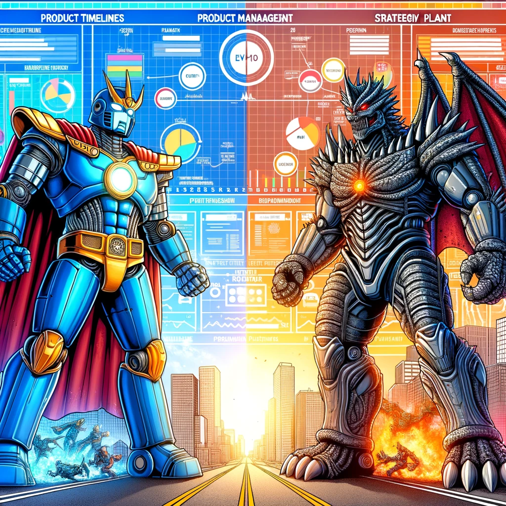

## Build-Measure-Learn

A shared product management language underpins the Kiln app. This language is an opinionated blend of design thinking, GIST, and a variety of related lean product development techniques that have been popularised over the last two decades. All of these techniques are variations of rapid iteration and the build-measure-learn loop.

##

an opinionated version of the build-measure-learn cycle popularised over two decades of lean product development techniques.

Good product managers iterate rapidly in order to learn fast. Kiln is based on a shared

Why not Miro for prototyping?
Why not ChatGPT for apps?

Product managers try to accelerate value creation and capture by changing and communicating choices.

I prefer this framing of product practice over any other because

In the messy, chaotic realities of organisational decision-making,

This is difficult to explain in theory and even harder to execute in practice because the path is nonlinear and the future is murky.

messy, chaotic realities of organisational decision-making, the line between hero and villain is thin, an

Kiln is a shared language and generative app to help execute this objective.

Kiln is a shared language and generative app built around this

This is the core value proposition

Value creation is for the user while value

This is the core tenet of Kiln - a framework and an app - to help PMs navigate the

We wade into the messy, chaotic realities of organisations to connect problems, solutions and decisions in positive ways for users and the business. The line between valu

explain gist and have a subsection for AI
