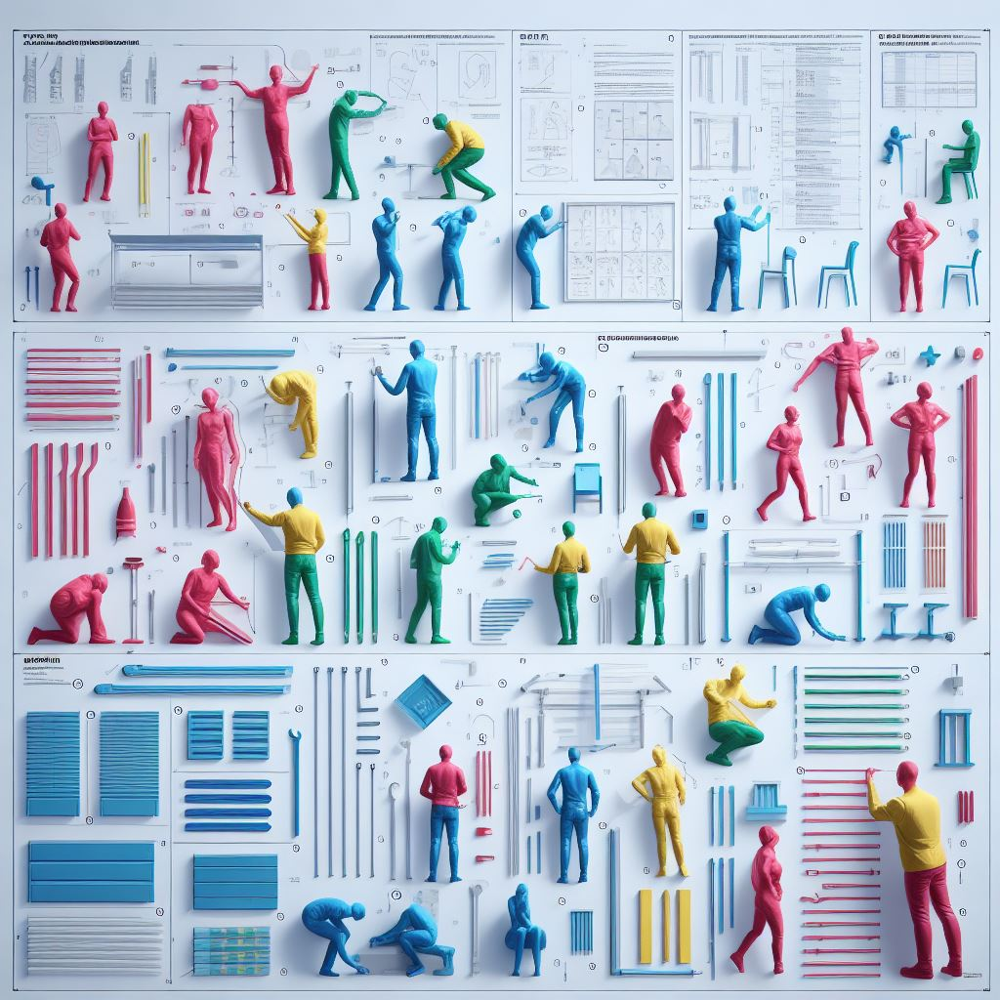

<figure markdown="span">
  { width="600" }
</figure>

<a href="about/" class="md-button">About</a>
<a href="on-writing/" class="md-button">On Writing</a>

---

-   **Recent**

    ---

    - [Wardley Factories](blog/2026/01/17/wardley-factories/) · Jan 2026
    - [The Shenzhen Recursion](blog/2026/01/16/the-shenzhen-recursion/) · Jan 2026
    - [The Taste Squeeze](blog/2026/01/15/the-taste-squeeze/) · Jan 2026
    - [Impossible Algebra](blog/2026/01/05/impossible-algebra/) · Jan 2026
    - [The Political Economy of Fog](blog/2026/01/01/the-political-economy-of-fog/) · Jan 2026
    - [Twelve Predictions for 2026](blog/2025/12/20/twelve-predictions-for-2026/) · Dec 2025

     

    [Archive →](blog/index.md)

