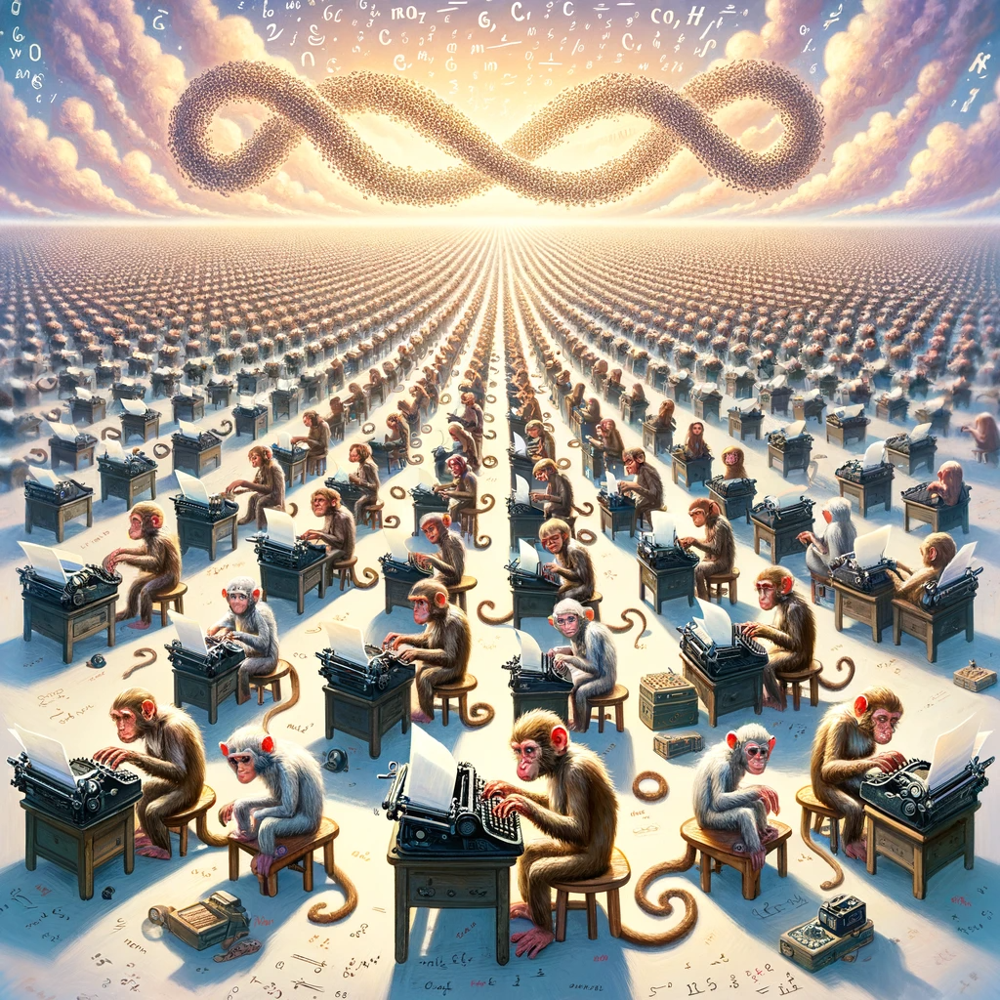

A list of emerging books and papers about artificial intelligence that help make sense of how this technology can be applied effectively in business contexts.

Each entry is a link to the source document (where available) and a short summary of its content. I'm interested in both abstract frameworks and concrete experiments.

- :light_bulb: concepts and frameworks
- :microscope: quantitative and qualitative primary data
- :chart_with_upwards_trend: market trends and secondary data

### Read in December 2023

| Title                                                                                                | Summary                                                     |
| ---------------------------------------------------------------------------------------------------- | ----------------------------------------------------------- |
| :microscope: [Ideas are dimes a dozen](https://dx.doi.org/10.2139/ssrn.4526071)                      | LLMs generate more and better ideas faster                  |
| :microscope: [Gen AI and Personalized Video Advertisements](https://dx.doi.org/10.2139/ssrn.4614118) | Personalised marketing videos increase ad clicks by 6% - 9% |
