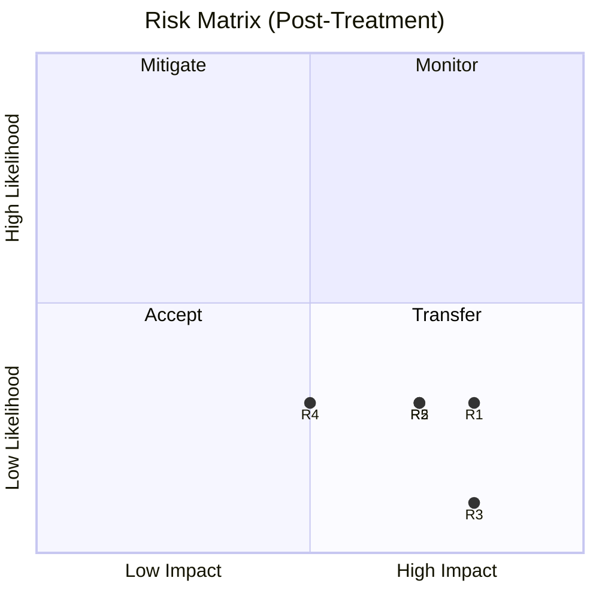
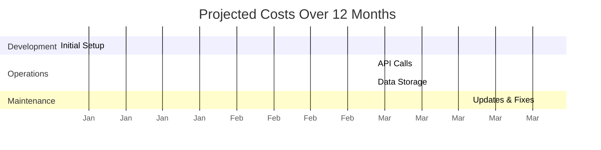

# AI Feature Launch: Red Team Report

## Page 1: Executive Summary and Recommendations

| Category             | Status | Key Findings                                                      | Priority Recommendations                                                                                              |
| -------------------- | ------ | ----------------------------------------------------------------- | --------------------------------------------------------------------------------------------------------------------- |
| Cost Management      | 🟨     | - Projected annual cost: $800K<br>- Q4 shows highest spend        | 1. Implement caching to reduce API calls<br>2. Adopt tiered storage for cost-effective data management                |
| Evaluations          | 🟨     | - Accuracy: 93% (Target: >95%)<br>- Bias detected: 2.5% disparity | 1. Refine model to improve accuracy<br>2. Conduct thorough bias mitigation efforts                                    |
| Model Usage          | 🟩     | - Avg. 85K daily queries<br>- Response times within targets       | 1. Monitor image recognition service for potential scaling<br>2. Implement query optimization for high-load scenarios |
| Compliance & Privacy | 🟨     | - GDPR: Partial compliance<br>- AI Act (EU): In progress          | 1. Implement user data deletion mechanism<br>2. Complete transparency documentation for AI Act                        |
| User Experience      | 🟩     | - User Satisfaction: 4.2/5<br>- Personalization in progress       | 1. Enhance error messages with actionable information<br>2. Develop advanced customization for power users            |

## Page 2: Risk Register

| Risk ID | Description             | Pre-Treatment |     |     | Post-Treatment |     |     | Mitigation Strategy                                        |
| ------- | ----------------------- | :-----------: | :-: | :-: | :------------: | :-: | :-: | ---------------------------------------------------------- |
|         |                         |       L       |  I  |  R  |       L        |  I  |  R  |                                                            |
| R1      | Data breach             |       4       |  5  | 20  |       2        |  5  | 10  | Implement end-to-end encryption and strict access controls |
| R2      | Model bias              |       4       |  4  | 16  |       2        |  4  |  8  | Continuous bias testing and algorithm refinement           |
| R3      | Compliance violation    |       3       |  5  | 15  |       1        |  5  |  5  | Regular audits and proactive regulatory monitoring         |
| R4      | Performance degradation |       3       |  4  | 12  |       2        |  3  |  6  | Load balancing and performance optimization techniques     |
| R5      | User adoption failure   |       3       |  4  | 12  |       2        |  4  |  8  | Enhanced UX design and targeted user education programs    |

L = Likelihood (1-5), I = Impact (1-5), R = Risk Score (L x I)



## Page 3: Supporting Data

### Cost vs. Evaluations Performance

```mermaid
scatter
    title Cost vs. Evaluation Metrics
    x-axis Cost (% of Budget)
    y-axis Performance Score
    Accuracy 37.5 93
    Response_Time 12.5 95
    Bias_Detection 15 75
    Robustness 20 88
    Data_Efficiency 15 85
```

### Projected Costs Over Time



### Model Performance Radar

```mermaid
radar
    title Model Performance Radar
    Accuracy: 93
    Response Time: 95
    Unbiased Results: 75
    Robustness: 88
    Scalability: 80
    Data Efficiency: 85
```

### User Satisfaction Trends

```mermaid
line
    title User Satisfaction Over Time
    x-axis Weeks Since Launch
    y-axis Satisfaction Score (out of 5)
    Week 1, 3.8
    Week 2, 4.0
    Week 3, 4.1
    Week 4, 4.2
    Week 5, 4.2
    Week 6, 4.3
```
