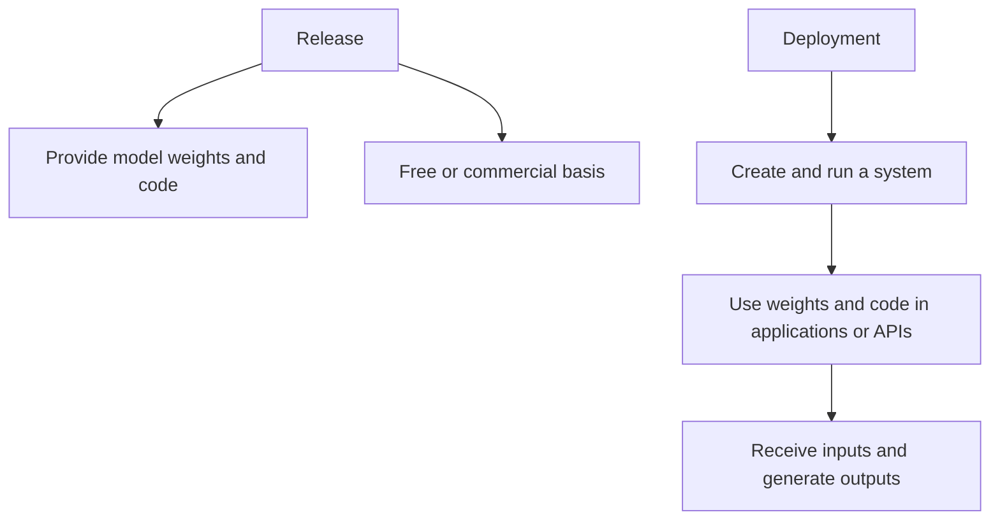

## Answer.AI - What Policy Makers Need to Know About AI (and What Goes Wrong if They Don’t)

### 1. Introduction

**An overview of what policymakers need to understand about AI, using SB 1047 as a case study.**

#### Key Points

- Importance of understanding AI for policymakers
- Example of SB 1047
- Goals of the document

**Content:**
Policymakers need to understand how AI truly works to implement effective legislation. This document will use SB 1047 as a case study to elucidate critical points policymakers should grasp. By understanding these elements, legislation can reflect the complexities and nuances of AI development and deployment, thereby achieving desired safety and innovation outcomes.

### 2. Background

**Overview of current AI legislation and the lack of AI expertise among policymakers.**

#### Key Points

- Lobbying for AI safety legislation
- Introduction of SB 1047
- Lack of AI expertise among policymakers

**Content:**
Various well-funded groups are lobbying US policymakers to introduce "AI safety" legislation. An example of such legislation is SB 1047, currently being considered in California, which could significantly impact AI developers and researchers. However, most policymakers lack a background in AI, making it challenging to comprehend the legislation's practical implications. This article aims to bridge that knowledge gap to help craft effective policies.

### 3. The Crux of the Issue: Deployment vs Release

**Explaining the critical difference between deploying and releasing AI models in the context of SB 1047.**

#### Key Points

- Definitions for 'release' and 'deployment'
- Importance of these terms in AI policy
- Examples of deployment and release

**Content:**
SB 1047 frequently uses the terms "deploy" and "release" without clearly defining them, leading to confusion. For clarity:

- **Release:** Making model weights and code available either freely or commercially.
- **Deployment:** Creating and running a system using model weights and code as part of an application or API.

The definitions are crucial as they form the basis for regulating AI models. While releasing a model involves sharing the actual code and parameters, deploying involves using the model within applications. Misunderstanding these terms leads to ineffective regulation, as seen in the current form of SB 1047.

> **Callout:** "A very simple and easy way to avoid hurting open source is to only legislate deployment, and to entirely avoid legislating release."

### 4. The Components of a Model

**A detailed look at the different components of AI models and their respective roles.**

#### Key Points

- Model weights
- Model code
- Training
- Fine-tuning
- Base models vs. fine-tuned models

#### 4.1 Model Weights

**Explanation of the term 'model weights' and its significance in AI models.**

#### Key Points

- Definition of model weights
- Example of Llama 3 70b model weights
- Significance in model safety

**Content:**
Model weights are parameters generated through training that allow the model to perform its tasks. For example, the first ten weights in Meta’s Llama3 70b model are just a list of numbers and are not inherently dangerous. These weights are part of the model and can affect its functionality, but on their own, they are harmless.

> **Callout:** "The weights are not, at this point, causing any safety problems. (That is not to say that they can’t be used to do something harmful. But that apparently minor technical distinction turns out to be critical!)"

#### 4.2 Model Code

**Details about the code that runs AI models and its interactions with model weights.**

#### Key Points

- Definition of model code
- Interaction with model weights
- Safety implications

**Content:**
The model code processes the input weights and performs mathematical functions like matrix multiplications to produce outputs. This code and weights together form a neural network. Like weights, the model code itself is not inherently dangerous, as it merely processes inputs to generate outputs.

> **Callout:** "As you can see from this description, just like creating weights cannot be inherently dangerous (since they’re just lists of numbers), neither can running a model be inherently dangerous (because they are just mathematical functions that take a list of numbers as an input, and create a new list of numbers as an output)."

#### 4.3 Training

**The process of training AI models, including initial steps and regulation issues.**

#### Key Points

- Initial random weights
- Sequence of inputs
- Modifications to weights
- Regulation in SB 1047

**Content:**
Training involves adjusting model weights to improve performance on tasks using a sequence of inputs and target outputs. This iterative process refines the weights to produce more accurate results. SB 1047 seeks to regulate this process by requiring developers to implement shutdown protocols before training starts, although training itself is not necessarily dangerous.

> **Callout:** "It is, however, possible for a model to be continuously deployed during training. For instance, perhaps as part of the continuous evaluation process the model is not only run, but the inputs and outputs are connected to external systems."

#### 4.4 Fine Tuning

**Fine-tuning process and its significance, including potential regulations by SB 1047.**

#### Key Points

- Process of fine-tuning
- Threshold implications
- Examples from Qwen 2 model

**Content:**
Fine-tuning adjusts pretrained models to better suit specific tasks, using existing weights as a starting point. This process can significantly alter a model's behavior. For example, fine-tuning can turn models like China’s Qwen 2 from safely aligned to CCP ideals to one that provides uncensored information.

#### 4.5 Base Models vs Fine-Tuned Models

**Comparison between base models and fine-tuned models in terms of regulation and use.**

#### Key Points

- General-purpose computation
- Training time
- SB 1047 constraints

**Content:**
Base models are general purpose and require substantial computational resources to train. Fine-tuned models, derived from base models, require less training but can exhibit different behaviors. SB 1047 aims to regulate the release of these models but does not adequately address these distinctions.

> **Callout:** "It also does not appear that systems or models that incorporate a base model, such as through fine-tuning, merging, and so forth, would either be covered under the law. These systems would not generally have much of their own training done, so would not be covered under the compute threshold."

### 5. Release vs. Deployment

**A comprehensive comparison between releasing a model and deploying a system.**

#### Key Points

- Definition of release
- Examples and implications
- Open source significance

#### 5.1 Releasing a Model

**What it means to release a model and its lack of direct harm.**

#### Key Points

- Definition of release
- Examples and implications
- Open source significance

**Content:**
Releasing a model involves making its code and weights available to others. This becomes critical for fostering innovation and ensuring transparency in AI development, as seen in open source projects which have driven much technological progress and security.

> **Callout:** "Because of the flexibility of AI models, their release in open source can be critical for ensuring transparency and fostering innovation."

#### 5.2 Deploying a System

**What it means to deploy a system and the potential harms involved.**

#### Key Points

- Definition of deployment
- Examples of harmful deployments
- Existing regulations and ethics

**Content:**
Deploying a system refers to using the model within applications, where it interacts with the environment and users. Harm can occur if the deployment outputs malicious or dangerous results, necessitating regulatory oversight to mitigate risks.

### Diagrams: Release vs. Deployment

> **Callout:** "A deployed model can cause harm... Sometimes this harm may be unintentional."

### 6. Creating Safe Systems

**Discussing techniques and regulations to ensure the creation of safe AI systems.**

#### 6.1 Regulating Deployed Systems

**How deployed systems can be regulated for safety, and proposed changes to SB 1047.**

#### Key Points

- Proposed terminology changes
- Focus on deployed systems
- Testing and monitoring protocols

**Content:**
Effective AI regulation should focus on deployed systems, where the model’s outputs directly affect users and environments. Implementing monitoring protocols and human oversight can mitigate risks, ensuring that AI systems operate safely.

> **Callout:** "Deployed systems can be carefully tested to identify how they behave in practice, and the system can (and generally should) include human oversight and appeals processes."

#### 6.2 Models are Neither Safe Nor Unsafe

**Why AI models themselves are not inherently safe or unsafe.**

#### Key Points

- General-purpose computation
- Comparison with other technologies
- Dual use capability

**Content:**
AI models, like other dual-use technologies such as computers and encryption, are neutral tools. They can be used for beneficial or harmful purposes, making it imperative to regulate their use rather than the technology itself.

### 7. The Impact of Open Source Model Regulation

**Analysis of how regulating open source AI models can impact innovation and legislation.**

#### 7.1 SB 1047 Could Block All Open Source Frontier Models

**Potential impacts of SB 1047 on open source AI development.**

#### Key Points

- Safety checks and their implications
- Effects on open source release
- Reliance on commercial models

**Content:**
SB 1047’s current form could halt the release of open source models, pushing innovation towards closed commercial models and reducing transparency. This is contrary to the legislative intent and could impair AI’s benefits to society.

> **Callout:** "Therefore, the requirement that they must be shown to be safe prior to release means that they can’t be released at all."

#### 7.2 SB 1047 Could Increase Politicization and Reduce Safety

**How misregulating open source AI could lead to greater politicization and reduced safety.**

#### Key Points

- Potential state responses
- Impact on AI development
- Importance of transparency and access

**Content:**
Overregulation could drive AI development away from jurisdictions like California, increasing politicization and reliance on models from countries with different values. Transparency and accessibility are essential for safety and innovation.

### 8. How to Fix SB 1047, and Regulate for AI Safety

**Recommendations and solutions to improve the regulation of AI safety.**

#### 8.1 Recommended Changes to SB 1047

**Specific recommendations to make SB 1047 effective without stifling innovation.**

#### Key Points

- Focus on system deployment
- Avoiding politicization
- Ensuring access to state-of-the-art models

**Content:**
To align with its goals, SB 1047 should focus on regulating the deployment of AI systems rather than the release of models. This approach promotes innovation while ensuring that AI applications are safe and align with societal values.

### 9. How Not to Fix SB 1047

**Common pitfalls and ineffective methods for fixing SB 1047.**

#### 9.1 Pitfalls in Changing SB 1047

**Ineffective methods for addressing issues in SB 1047 and their consequences.**

#### Key Points

- Changing definitions
- Impact on compliance
- Concentration of AI power

**Content:**
Avoid changing the core definitions in SB 1047, as this can lead to unintended consequences like hindering compliance and consolidating AI control among a few large companies. Effective fixes should focus on practical deployment issues.

### 10. Epilogue: Should AI Be Open Sourced?

**A discussion on the pros and cons of open sourcing AI models.**

#### Key Points

- Community benefits
- Security and innovation
- Human Existential Enhancement Factor (HEEF)

**Content:**
Open sourcing AI models allows for community-driven innovation and bolsters security through transparency. However, the debate persists about balancing these benefits against the risks. The concept of a “Human Existential Enhancement Factor” (HEEF) could be a valuable addition to the AI safety discourse, emphasizing the potential of AI to enhance humanity’s resilience against existential threats.

> **Callout:** "Open sourcing AI can potentially lead to community-driven innovation and bolsters security through transparency."
